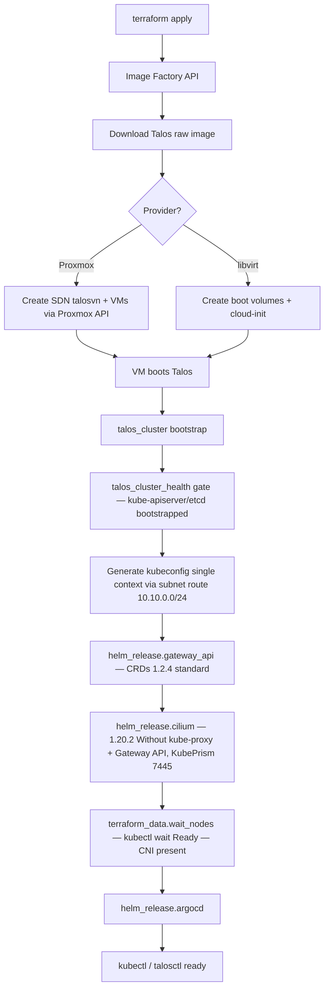

# Architecture

> Deep dive into the cluster topology, repository layout, and bootstrap flow. For the quick overview, see [README](../README.md).

[← Back to README](../README.md) · [Networking →](./networking.md) · [Variables →](./variables.md) · [Operations →](./operations.md)

> **Two-repo contract:** This repo is the **substrate** (VMs, Talos bootstrap, SDN/NAT, kubeconfig, Cilium + Gateway API + ArgoCD). The companion repo [gitops-platform](https://github.com/Seom88/gitops-platform) runs **everything on top** — Longhorn (wave-0, CSI-gated), Vault, SeaweedFS, monitoring, Tailscale ingress — via App-of-Apps sync-waves (`00-longhorn` → `04-tailscale`). Longhorn node prerequisites (UserVolumeConfig `/var/mnt/<name>` + `iscsi-tools`/`util-linux-tools`) stay here; volumes are claimed there. For _why_ see [Why This Exists](../README.md#why-this-exists) and [Decisions](./decisions.md) ([Talos vs kubeadm](./decisions.md#1-talos-linux-vs-kubeadm), [composable ArgoCD](./decisions.md#6-argocd-vs-fluxcd), [Cilium Helm + Gateway API](./decisions.md#7-cilium-inlinemanifest-vs-helm-application)).

## Provider topologies

### Proxmox provider

```
Proxmox VE (SDN talosvn — VNet 10.10.0.0/24, SNAT)
├── N × control plane nodes  (direct IP, health-gated, optional allow_scheduling)
└── M × worker nodes

Terraform (environments/proxmox/<env>/)
├── Backend                  (dev: local, prod: S3-compatible terraform-homelab)
├── SDN network              (proxmox_sdn_zone + VNet talosvn + subnet + applier, modules/proxmox/network.tf)
├── Image download           (proxmox_download_file bootstrap-only, modules/proxmox/main.tf)
├── VMs                      (proxmox_virtual_environment_vm per node)
└── modules/talos-cluster/
    ├── Bootstrap (talos_cluster, health gate talos_cluster_health)
    └── Kubeconfig (single context via subnet route 10.10.0.0/24)
```

> **File refs:** `modules/proxmox/network.tf` (zone → VNet → subnet → applier), `modules/proxmox/main.tf` (VMs + image), `modules/talos-cluster/main.tf` (bootstrap).

### Libvirt provider

```
Libvirt (qemu:///system)
├── talos-cp1         (control plane)
├── talos-w1          (worker)
├── talos-w2          (worker)
└── talos-w3          (worker)

Terraform (environments/libvirt/<env>/)
├── NAT network       (virbr-talos, 10.0.1.0/24 DHCP from node MACs, modules/libvirt/network.tf)
├── Image cache       (nocloud raw image, persistent ~/.cache/talos-images, modules/libvirt/image.tf)
├── Storage pool      (talos-pool at /var/lib/libvirt/images/talos, modules/libvirt/pool.tf)
├── Boot volumes + domains (modules/libvirt/vms.tf, deterministic MAC via md5 when omitted)
└── modules/talos-cluster/
    ├── Bootstrap (talos_cluster) + health gate (talos_cluster_health)
    └── Kubeconfig (single context via subnet route)
```

> **File refs:** `modules/libvirt/network.tf` (NAT + DHCP + DNS), `modules/libvirt/image.tf` (factory image + cache), `modules/libvirt/pool.tf` (pool), `modules/libvirt/vms.tf` (volumes + domains), `modules/libvirt/cluster.tf` (bootstrap + health gate).
>
> **Libvirt specifics:** host-side `qemu-img convert` raw → thin `qcow2` (dir pool does not auto-convert), UEFI `q35` with `qcow2` virtio driver type, Talos-layer-only health gate (`skip_kubernetes_checks=true`; node-Ready waits live in the platform layer).

Both providers share the same provider-agnostic `modules/talos-cluster` module for Talos bootstrap and kubeconfig generation (`talos_machine.control_plane` / `talos_machine.worker` + `talos_cluster`).

> **Disks:** Proxmox VMs use SCSI (`scsi0` for the system disk, `scsiN` for data/swap, `virtio-scsi-single`, `ssd=true`, `floating=0`, `model=virtio`); each extra disk accepts an optional per-disk `ssd` flag (default `true`). `install_disk_match` is required everywhere (`/dev/sda` on Proxmox, `/dev/vda` on libvirt) and selects the Talos install disk.

## Memory / swap design

Each VM carries one dedicated 5 GiB swap disk (Proxmox blank disk in `local-lvm`; libvirt managed QCOW2 volume in the VM pool), provisioned after the data disks. Talos creates a fixed 4 GiB `SwapVolumeConfig` on it (`grow = false`, selector `!system_disk && disk.size == 5368709120u`); Longhorn `UserVolumeConfig` selectors carry a data-disk size floor so they never claim the swap disk. Kubelet runs `memorySwap.swapBehavior: LimitedSwap`, zswap caps at 20% (`ZswapConfig.maxPoolPercent = 20`), and sysctls set `vm.swappiness = "130"` / `vm.page-cluster = "0"`. No LUKS2.

## Repository structure

```
.
├── .github/workflows/
│   ├── deploy.yaml                 # CI: validate + single terraform apply per env (S3 state for prod)
│   └── destroy.yaml                # CI: terraform destroy (S3 state for prod)
├── docs/
│   ├── adr/                        # Architecture Decision Records (MADR: 001–006)
│   ├── architecture.md             # ← you are here
│   ├── networking.md               # SDN, NAT, Tailscale subnet routing
│   ├── variables.md                # All input variables
│   ├── operations.md               # Destructive changes, upgrades
│   ├── platform.md                 # ArgoCD composable module
│   ├── usage.md                    # Requirements, access, tasks, outputs
│   ├── ci-cd.md                    # Workflows, Renovate
│   └── demo.png
├── environments/                   # Composed roots — one state per env (infra + platform)
│   ├── proxmox/
│   │   ├── dev/                    # backend local — bpg/proxmox 0.114.0, helm ~>3.2, talos 0.12.0-beta.0
│   │   └── prod/                   # backend s3 (S3-compatible bucket terraform-homelab, key proxmox/prod/terraform.tfstate)
│   └── libvirt/
│       ├── dev/                    # backend local — dmacvicar/libvirt ~>0.9.8, talos 0.12.0-beta.0
│       └── prod/                   # backend s3 (S3-compatible bucket terraform-homelab, key libvirt/prod/terraform.tfstate)
│       # each env: main.tf, provider.tf, variables.tf, outputs.tf, terraform.tfvars
├── modules/
│   ├── talos-image/                # Canonical Image Factory wiring: extensions data -> schematic -> download/installer URLs
│   ├── talos-cluster/              # Provider-agnostic: bootstrap (talos_cluster), kubeconfig, machine configs
│   ├── proxmox/                    # Proxmox VE: SDN talosvn (network.tf), VMs (main.tf), talos-cluster call
│   ├── libvirt/                    # Libvirt: network.tf, image.tf, pool.tf, vms.tf, cluster.tf (health gate)
│   └── platform/                   # Composable ArgoCD (helm_release) — called from each environment root
├── renovate.json                   # Renovate bot: weekly Terraform + talos_version/argocd_version updates (manual-review)
├── secrets/<provider>/<env>/       # Generated talosconfig.yaml, kubeconfig.yaml (.gitignored, per env)
├── justfile                        # Unified tasks: just provider=<proxmox|libvirt> env=<prod|dev> tf-apply / tf-apply-upgrade / tf-destroy ...
└── LICENSE, README.md, CHANGELOG.md, CONTRIBUTING.md
```

> All 4 envs ship input validations (semver for `talos_version`/`kubernetes_version`/`argocd_version`, CIDR for `network_cidr`, IP for `gateway`/`cp_ips`, non-empty `cluster_name`/`env_name` + `^(dev|prod)$` — 57 blocks total) and a parameterized `drain_on_upgrade` (bool, default `false`, platform-aware; `false` for Longhorn prod). See [Variables](./variables.md) and [CI/CD](./ci-cd.md).

## How it works



> **Cilium data plane:** eBPF replaces kube-proxy (`kubeProxyReplacement=true`, Talos `KubeFlannelCNIConfig` delete + `KubeProxyConfig` `enabled: false`, KubePrism `localhost:7445`). Gateway API CRDs (`christianhuth/gateway-api-crds` 1.2.4) install before Cilium 1.20.2. The DAG is `gateway_api → cilium → wait_nodes → argocd`; this ordering ensures CRDs exist before Cilium and nodes become `Ready` only after the CNI is present. Values, socketLB configuration for `kubectl port-forward`/`exec`, and Hubble observability are detailed in [Networking: Cilium CNI](./networking.md#cilium-cni-ebpf-data-plane).

### Proxmox path

Terraform creates the SDN stack (`proxmox_sdn_zone` + VNet `talosvn` + subnet `snat = true` + `proxmox_sdn_applier`), downloads the Talos image and creates VMs with cloud-init. Talos boots, `talos_cluster` bootstraps the first control plane node, `talos_cluster_health` blocks until kube-apiserver, etcd and all nodes are bootstrapped (direct per-node IPs, health-gated), `local_file.kubeconfig` materializes a single-context kubeconfig via the subnet route `10.10.0.0/24`, and `module.platform` installs Gateway API CRDs → Cilium → `wait_nodes` (CNI-gated `Ready`) → ArgoCD in the same apply (DAG `gateway_api→cilium→wait_nodes→argocd`).

### Image Factory (no YAML)

No schematic YAML files: `modules/talos-image` resolves extensions via `talos_image_factory_extensions_versions`, publishes the schematic (`talos_image_factory_schematic`, `schematic_id` output), and reads installer/disk URLs from `talos_image_factory_urls` — Proxmox uses the secureboot flavor, libvirt the plain flavor unless `secureboot = true`.

### Libvirt path

Terraform downloads the nocloud raw image, creates boot volumes, and injects cloud-init with static IPs and Talos machine config. VMs boot via libvirt, the cluster bootstraps, the health gate blocks until Ready, and the same single-context kubeconfig + platform flow runs.

Both paths share the same `talos-cluster` module for bootstrap and kubeconfig generation (`talos_machine.control_plane` / `talos_machine.worker` + `talos_cluster`, not legacy `talos_machine_configuration_apply`).

## Full Highlights (12 — detailed)

Preserved verbatim from the original README (trimmed to 6 in [README Highlights](../README.md#highlights)):

- **Two providers** — choose Proxmox VE (`bpg/proxmox`) or libvirt (`dmacvicar/libvirt`); both share the same provider-agnostic `talos-cluster` module
- **Modular design** — infrastructure (VMs) and configuration (Talos/K8s) are separated; `talos-cluster` module works with any provider
- **Control plane** — 1 control-plane + 3 workers in prod per [ADR 004](./adr/004-single-control-plane-for-32gb-homelab.md) (direct per-node IPs health-gated via `talos_cluster_health`; no etcd HA on the 32 GiB host)
- **Dedicated workers** — worker VMs keep workloads off the control plane; disk sizes and datastores configurable per node (20 GB CP default, 100 GB worker default, `disk_size` + `datastore`/`pool` required per node)
- **Per-node scheduling** — `nodes_cp[].allow_scheduling` controls `KubeNodeConfig` taint delete per control-plane node (pre-1.14: `cluster.allowSchedulingOnControlPlanes`; replaces the old global flag)
- **Tailscale subnet routing only** — Tailscale Talos extension disabled (see [ADR 001](./adr/001-remove-tailscale-extension.md)). Cluster reachability for `10.10.0.0/24` is via a Tailscale subnet router (`tailscale set --advertise-routes=10.10.0.0/24` on the Proxmox host, `tailscale/github-action` in CI). No per-node Tailscale kubeconfigs — single context via subnet route. See [Networking](./networking.md)
- **Longhorn-ready** — one UserVolumeConfig per distinct `disks[].name` (`/var/mnt/<name>`); Longhorn runs with `defaultDataPath=/var/mnt/data`, no kubelet `extraMounts`. System extensions (`iscsi-tools`, `util-linux-tools`) bundled in the Image Factory schematic (`modules/talos-image`)
- **Image caching (libvirt)** — nocloud raw images are downloaded, cached, and reused across applies; only the first apply downloads (`~/.cache/talos-images`, `modules/libvirt/image.tf`)
- **NAT networking (libvirt)** — dedicated `virbr-talos` bridge with DHCP reservations and DNS entries from node MACs (`modules/libvirt/network.tf`)
- **Custom Talos image** — Image Factory schematic bundles `iscsi-tools`, `qemu-guest-agent`, `util-linux-tools` (tailscale extension removed — see ADR 001, subnet routing only); canonical set lives in `modules/talos-image/variables.tf`
- **SDN networking (Proxmox)** — `talosvn` VNet (`proxmox_sdn_zone` + `proxmox_sdn_vnet` + `proxmox_sdn_subnet` with `snat = true`) plus `proxmox_sdn_applier` so the bridge exists before VMs boot; VMs get outbound internet via MASQUERADE. See [Networking](./networking.md)
- **In-place Talos upgrades** — `talos_machine` keeps the OS version in sync via `image`; bumping `talos_version` triggers a sequential rolling upgrade (pull → install → reboot) with parameterized `drain_on_upgrade` (bool, default `false`, platform-aware; `false` for Longhorn prod). See [Operations](./operations.md)
- **Hardened inputs** — 57 validation blocks across `modules/talos-cluster`, `modules/proxmox`, `modules/libvirt` and all 4 envs: semver for `talos_version`/`kubernetes_version`/`argocd_version`, CIDR for `network_cidr`, IP for `gateway`/`cp_ips`, non-empty `cluster_name`/`env_name` (`^(dev|prod)$`), nullable guards for `machine_secrets`/`client_configuration`. See [Variables](./variables.md)

---

Next: [Networking →](./networking.md) · [Variables →](./variables.md) · [Usage →](./usage.md)
